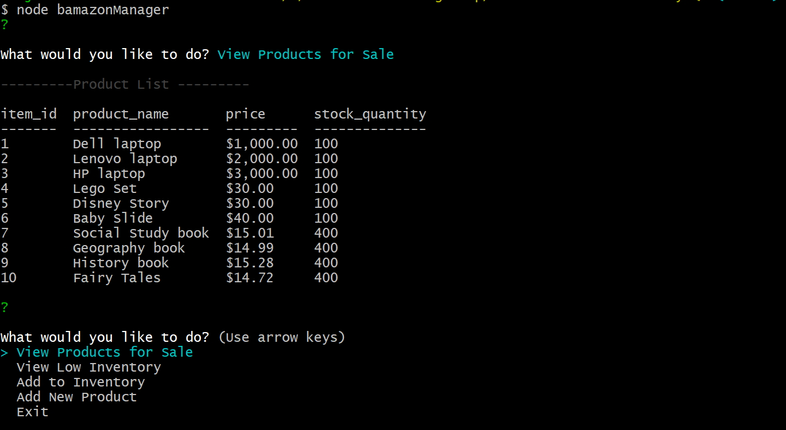
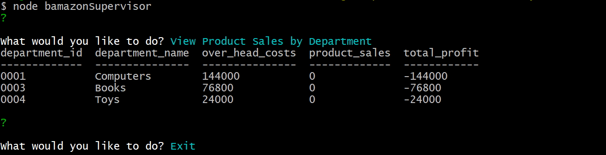
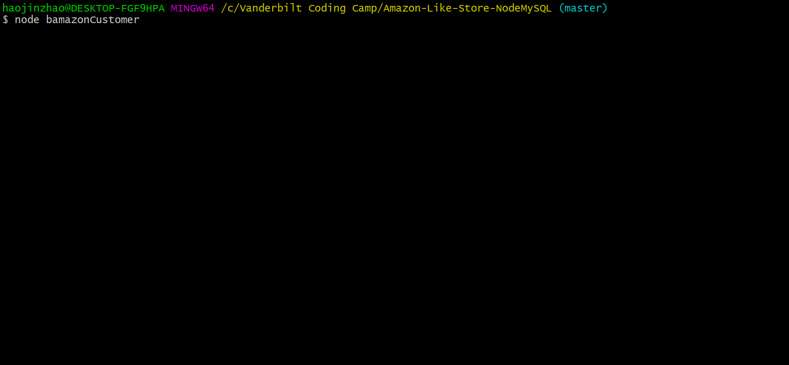
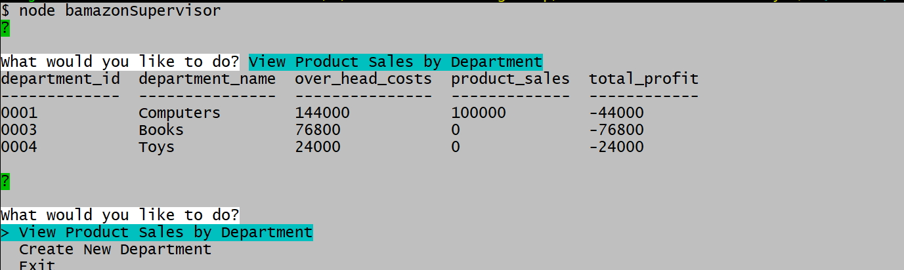
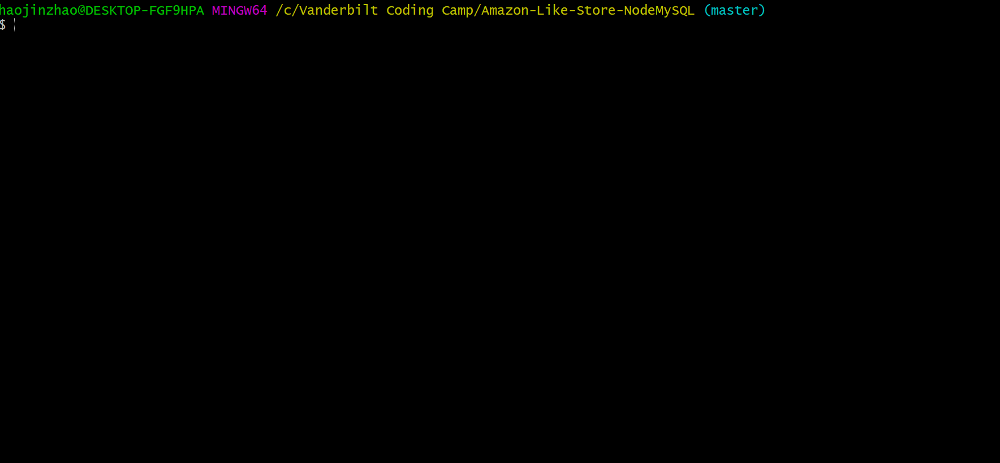
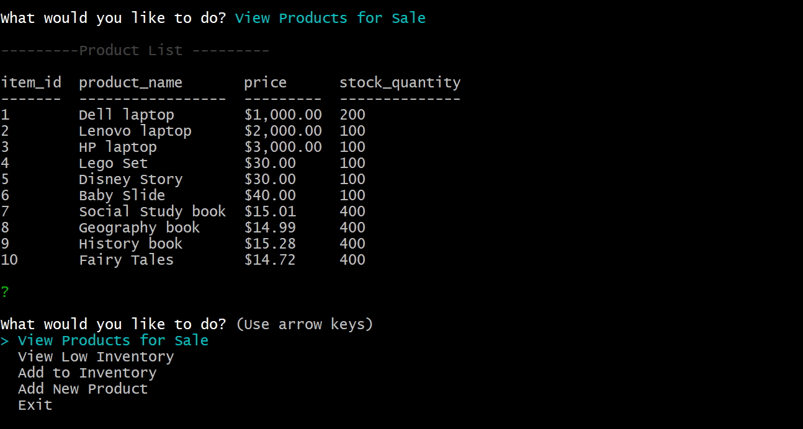
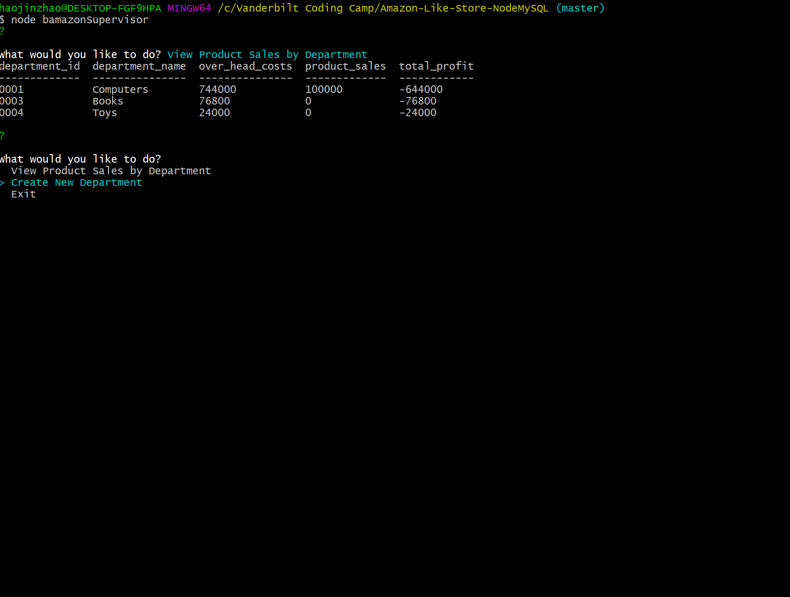
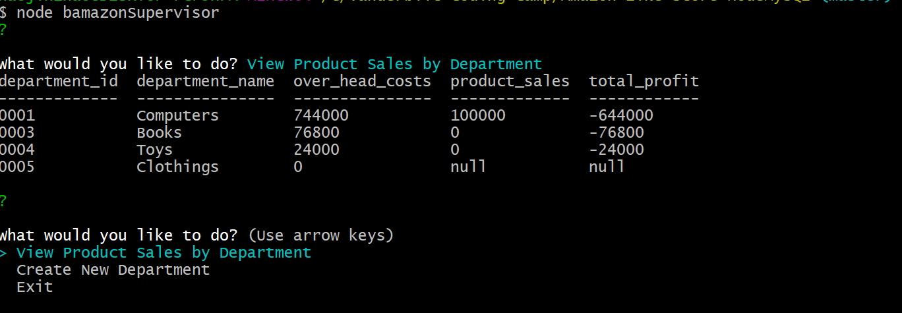
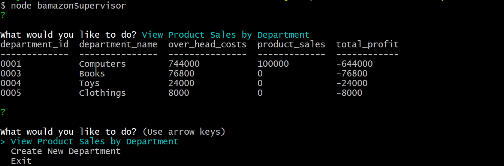
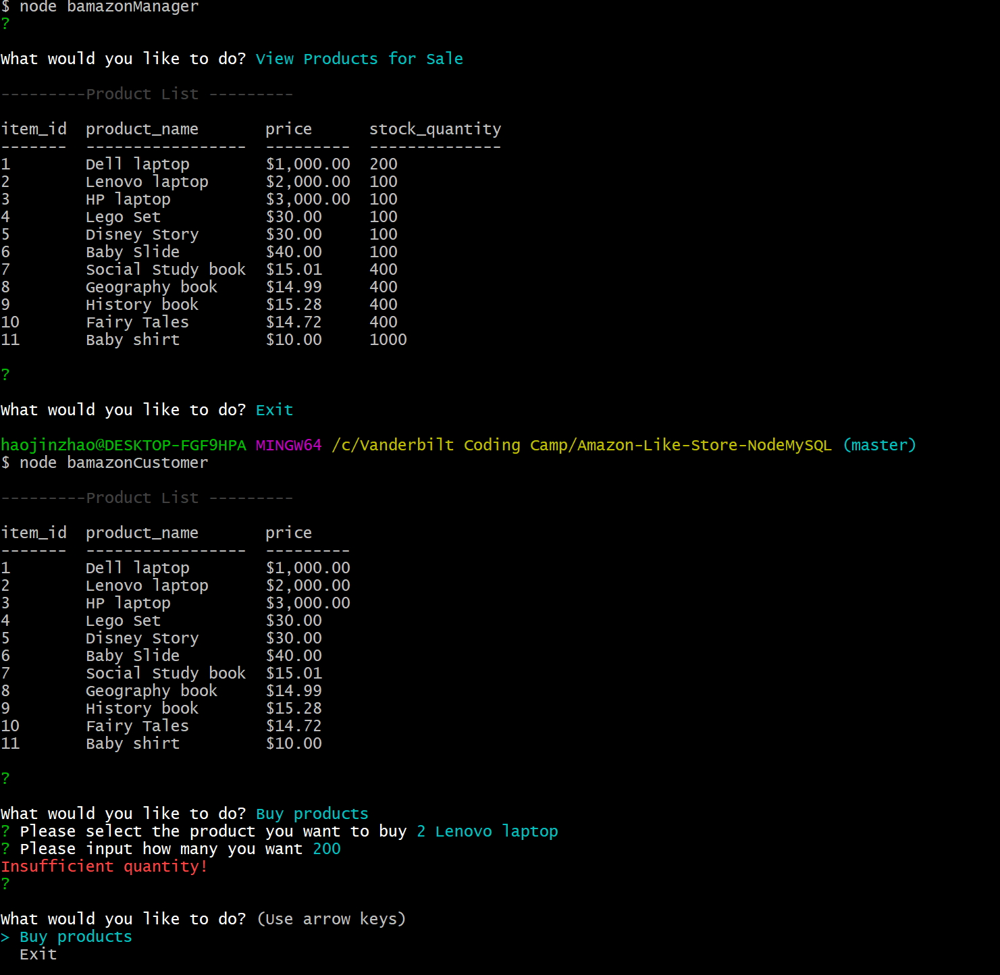

## Amazon-Like-Store-NodeMySQL
Amazon-like storefront using Node.js and MySQL

## Overview
The app includes three main functions:

1. Customer View   
    * Running this application will first display all of the items available for sale.     Include the ids, names, and prices of products for sale.
    * Customer can view the products and select a product to buy.
    * When the app takes in orders from customers and it depletes stock from the store's inventory. 
    * When the store's inventory can't meet customer's order need, display insufficient inventory message. 

2. Manager View
    * Running this application will list a set of menu options:
        * View Products for Sale        
        * View Low Inventory        
        * Add to Inventory        
        * Add New Product

    * When manager adds to inventory or new product, the app will update the department's   over_head_cost accordingly, based on a predefined cost rate.  

3. Supervisor View
   * Running this application will list a set of menu options:

        * View Product Sales by Department   
        * Create New Department

    *. When a supervisor selects `View Product Sales by Department`, the app displays a summarized table in their terminal/bash window. Use the table below as a guide.

    | department_id | department_name | over_head_costs | product_sales | total_profit |
    | ------------- | --------------- | --------------- | ------------- | ------------ |
    | 01            | Electronics     | 10000           | 20000         | 10000        |
    | 02            | Clothing        | 60000           | 100000        | 40000        |

### App Link
https://github.com/helenhao888/Amazon-Like-Store-NodeMySQL.git

### Developer
    Developed by Helen Hao (helenhao888)
    
### Technologies
    Node.js 
    MySQL
    javascript
    inquirer package
    numeral package
    chalk package

### Instructions

1. Install the app 
   Set databse configuration information in .env file. 
   Clone all the codes.
   Install all the packages by 'npm install'

2. Run the app
   Customer View   : `Node bamazonCustomer`
   Manager View    : `Node bamazonManager`  
   Supervisor View : `Node bamazonSupervisor`

### Screenshots
1. Customer buy a product 
   Before the customer puts an order, use the manager view to display all the products
   
   Before the customer puts an order,  view department information.
   
   Customer buy a product
   
    
   After the customer put an order,  view department information. The product_sales column has been updated , adding the total price of this order.
   

2. Manager views low inventory and add to inventory
   

3. After manager added to inventory, manager views the products for sale. The stock quantity has been added. Also the over head costs in department been added too, see the next step.  
   

4. Supervisor view products by department   
   

5. Supervisor create a department and view products by deparment
   
   After create a new department, view product by department, supervisor can see all the departments including the new department . As there is no products under this department(no record in products table), so the product_sales and total_profits are null. 
   

6. Manager create a new product under the new department 0005
   
   Supervisor view all products by department
   

7. When customer buy a product whose sotck quantity is lower than the customer's need
   

8. This app includes input validations. Use this app to find more.

### Contact Information

   Helen Hao :
   :link:[linkedIn](https://www.linkedin.com/in/jinzhao-helen-hao-611b3752/) 
   :link:[Portfolio](https://helenhao888.github.io)